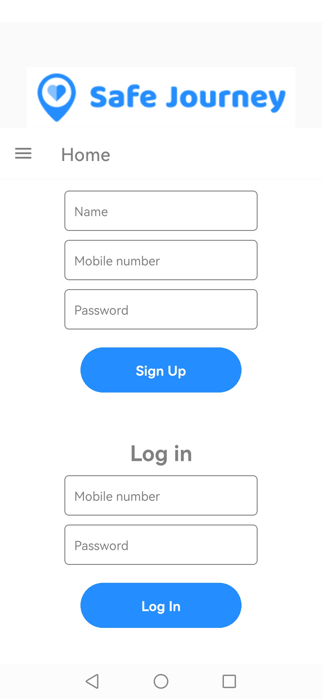
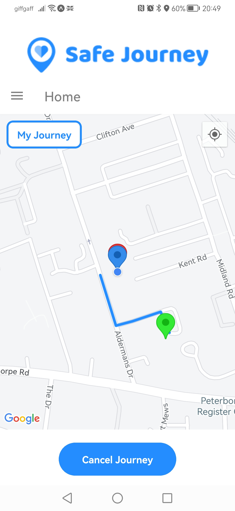
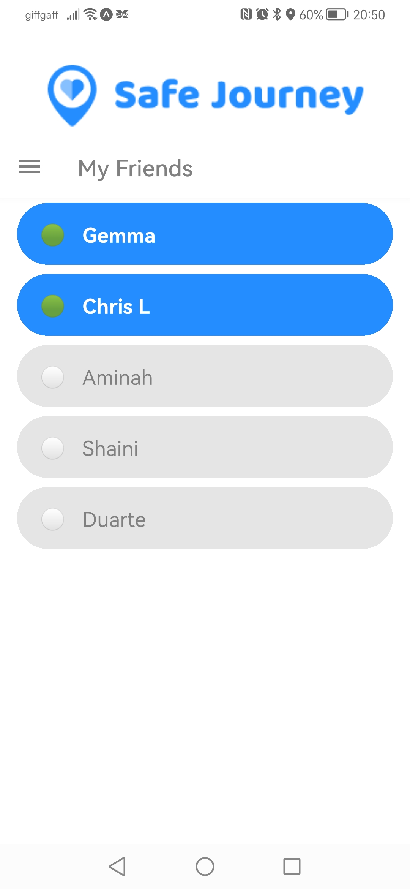
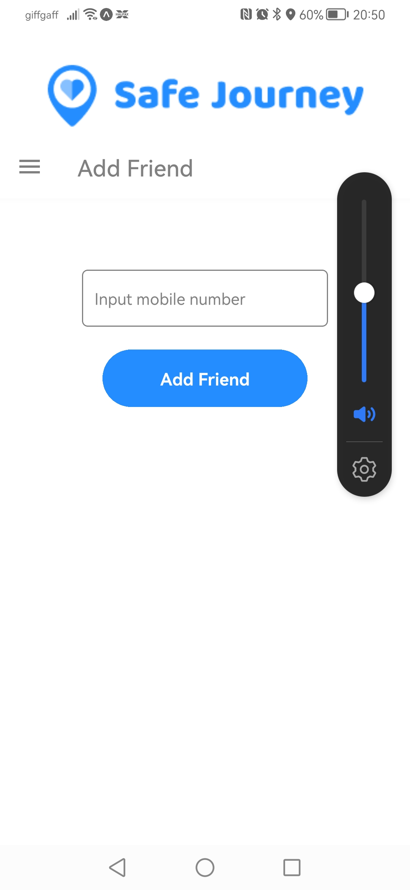
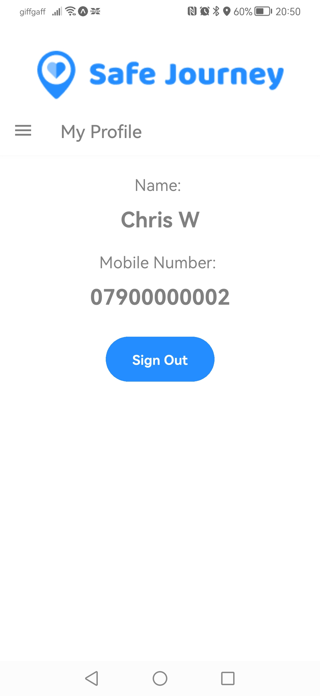
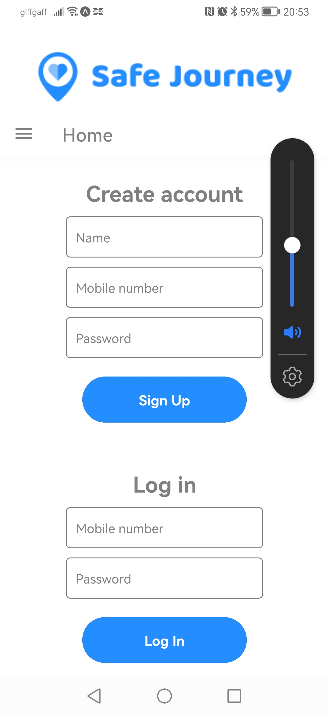

## SafeJourney

A lone person tracking safety app, so your friends can track your journey home.

Create an account, along with all your friends, login and select your destination either from an address, establishment or simply tap on the map. 

As soon as you start your journey a notification is sent to all your friends and they can immediately view your location in real time as you make your way to your destination. Your start point and destination is also shown along with a route generated by google maps dependent on whether you're walking or driving.

When you get home your journey is cancelled and your friends know you're home safe.

To add a friend simply type in their phone number and if they have signed up and are in the database, they will be added to your friends list.




### Installation

Fork and clone the repo.

`````
cd safe-journey-2 && npm i
`````

create an account at https://expo.dev
download expo go onto an android device

`````
npx expo start
`````
make sure you're on the same network as the machine you're using for coding
If you're not directly (using wsl for example)

`````
npx expo start --tunnel
`````
you can now run the app on your device


required - root file named .env containing EXPO_PUBLIC_API_KEY=[your google maps api key with directions enabled]

API key for google map api's is stored also stored in app.json 

`````
You will need this data in app.json in the root directory of the project
{
  ....
  
      "android": {
        "config": {
          "googleMaps": {
            "apiKey": "**your maps api key goes here**"
          }
        },
   
  `````
